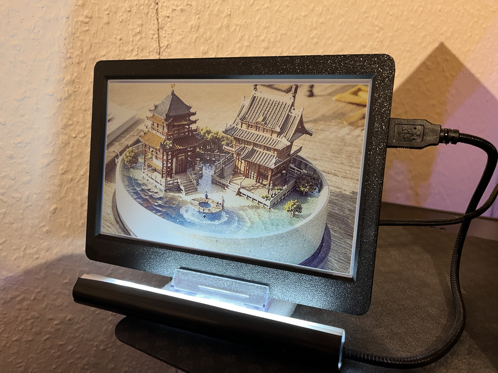
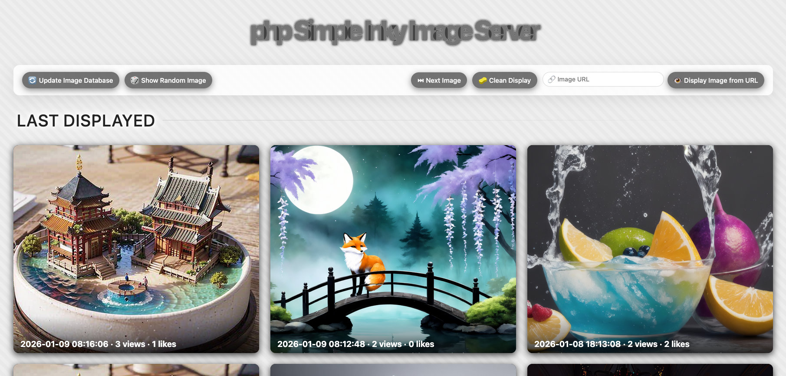

# phpSimpleInkyImageServer

A simple Python and PHP setup to supply your [Pimoroni Inky e-paper display](https://shop.pimoroni.com/products/inky-impression-7-3) with images.

Now with a clean web UI!  
Live demo available at: https://inky.bluepaw.de/

## Features

- Change the displayed image every X minutes  
  (manually via button A / random image via button B, weighted by likes)
- Mark the current image as favorite  
  (like: button C / dislike: button D)
- Remote control your Inky display using the web UI  
  (trigger the next random image or select a specific image)
- Supports SQLite (default) and MySQL  
  (MySQL is recommended if you have more than ~500 images)

## Installation

### 1. Web server setup

1. Copy all files from the `web` directory to any web server (e.g. your NAS)
2. Rename `config.php.dist` to `config.php` and adjust the settings as needed
3. Optional:  
   If you don’t need the web UI, you only have to copy `api.php` and `config.php`

### 2. Inky device setup

1. Copy `run.py` to your Inky setup
2. Install the required Pimoroni libraries:
   - [Pimoroni – Combined Python Library](https://github.com/pimoroni/inky)
   - or follow the tutorial  
     [Pimoroni – Getting Started with Inky Impression](https://learn.pimoroni.com/article/getting-started-with-inky-impression)
3. Check the configuration options at the top of `run.py`
4. Optional:  
   See `cronjob.example` for automatic startup

## Example Pictures

